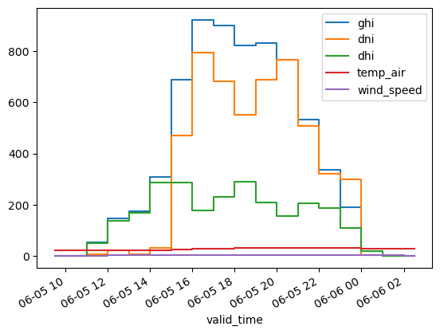
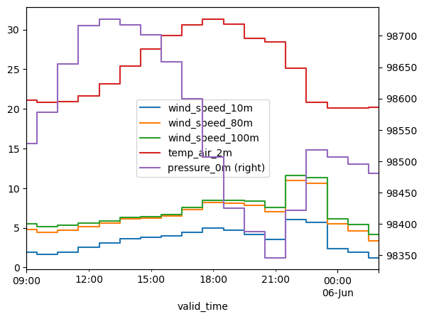

# hEFTy
Some (relatively) lightweight short-term **e**nergy **f**orecasting **t**ools for solar, wind, and load.

This repository currently includes solar and wind tools, but may expand one day to include electric load. Forecasts can be created using the NOAA GFS, NOAA GEFS, NOAA HRRR, and ECMWF IFS and AIFS (open data versions) models. 

For solar, look at the notebook [solar_example.ipynb](examples\solar_example.ipynb) for some examples, and [more_solar_examples.ipynb](examples\more_solar_examples.ipynb) for more examples. Both of these convert the resource forecasts to power.

There are also solar ensemble forecasts demonstrated in [ensemble_example.ipynb](examples\ensemble_example.ipynb).

For wind, look at the notebook [wind_example.ipynb](examples\wind_example.ipynb). The wind tools are not as developed at the solar tools.

The [custom.py](src\hefty\custom.py) module is intended to help with getting forecasts of "custom" weather parameters, not necessarily specific to wind or solar, which migh be useful for load forecasting.

## Quick examples

Here's a quick example of getting a solar resource data forecast:

```python
from hefty.solar import get_solar_forecast

latitude = 33.5
longitude = -86.8
init_date = '2024-06-05 6:00' # datetime the forecast model was initialized
resource_data = get_solar_forecast(
    latitude,
    longitude,
    init_date,
    run_length=18, # 18 hours are included in the forecast
    lead_time_to_start=3, # forecast starts 3 hours out from the init_date
    model='hrrr', # use NOAA HRRR
)
resource_data[
    ['ghi','dni','dhi','temp_air','wind_speed']
              ].plot(drawstyle='steps-mid')
```

with this output:



Here's a wind resource forecast:

```python
from hefty.wind import get_wind_forecast

latitude = 33.5
longitude = -86.8
init_date = '2024-06-05 6:00' # datetime the forecast model was initialized
resource_data = get_wind_forecast(
    latitude,
    longitude,
    init_date,
    run_length=18, # 18 hours are included in the forecast
    lead_time_to_start=3, # forecast starts 3 hours out from the init_date
    model='gfs', # use NOAA GFS
)
resource_data[
    ['wind_speed_10m', 'wind_speed_80m',
    'wind_speed_100m', 'temp_air_2m', 
    'pressure_0m']
    ].plot(secondary_y=['pressure_0m'], drawstyle='steps-mid')
```
with this output (note that pressure is on the secondary y-axis):



## Installation

A virtual environment is strongly recommended. You can install from PyPi with:

```
pip install hefty
```

To run the example jupyter notebooks:

```
pip install jupyter
```

## References
This project uses several Python packages, including pvlib, an open-source solar PV modeling package [1, 2], and Herbie [3, 4], a package for accessing weather forecast data from NOAA. `pv_model.py` (with the `model_pv_power()` function used here) comes from [5] which leverages some functions from [6].


[1] Anderson, K., Hansen, C., Holmgren, W., Jensen, A., Mikofski, M., and Driesse, A. “pvlib python: 2023 project update.” Journal of Open Source Software, 8(92), 5994, (2023). [DOI: 10.21105/joss.05994](http://dx.doi.org/10.21105/joss.05994).

[2] https://github.com/pvlib/pvlib-python

[3] Blaylock, B. K. (2025). Herbie: Retrieve Numerical Weather Prediction Model Data (Version 2025.3.1) [Computer software]. https://doi.org/10.5281/zenodo.4567540

[4] https://github.com/blaylockbk/Herbie

[5] https://github.com/williamhobbs/pv-system-model

[6] Hobbs, W., Anderson, K., Mikofski, M., and Ghiz, M. "An approach to modeling linear and non-linear self-shading losses with pvlib." 2024 PV Performance Modeling Collaborative (PVPMC). https://github.com/williamhobbs/2024_pvpmc_self_shade 
