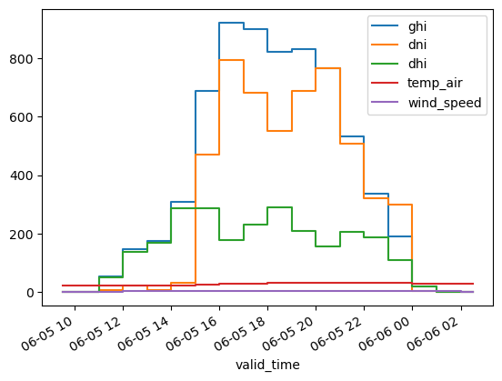
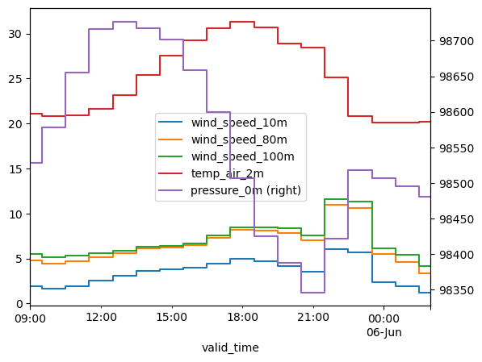

# hEFTy
Some (relatively) lightweight short-term **e**nergy **f**orecasting **t**ools for solar, wind, and load.

This repository currently includes solar and wind tools, but may expand one day to include electric load. Forecasts can be created using the NOAA GFS, NOAA GEFS, NOAA HRRR, and ECMWF IFS and AIFS (open data versions) Numerical Weather Prediction (NWP) and Machine Learning Weather Prediction (MLWP) models. The ECMWF CAMS version of IFS is also included, but only via `hefty.solar.get_solar_forecast()`, and it requires `cdsapi` to be installed and the user needs an API key (see https://ads.atmosphere.copernicus.eu/how-to-api).

For solar, look at the notebook [solar_example.ipynb](examples/solar_example.ipynb) for some examples, and [more_solar_examples.ipynb](examples/more_solar_examples.ipynb) for more examples. Both of these convert the resource forecasts to power.

There are also solar ensemble forecasts demonstrated in [ensemble_example.ipynb](examples/ensemble_example.ipynb).

For wind, look at the notebook [wind_example.ipynb](examples/wind_example.ipynb). The wind tools are not as developed at the solar tools.

The [custom.py](src/hefty/custom.py) module is intended to help with getting forecasts of "custom" weather parameters, not necessarily specific to wind or solar, which migh be useful for load forecasting.

### Handling dates and times

Handling dates and times can get a bit complicated when it comes to forecasts. hefty tries to match conventions used in the Solar Forecast Arbiter (https://forecastarbiter.epri.com/definitions/), such as "_lead time to start_" and "_run length_". However, the Arbiter uses the term "_issue time_" to represent the time that a forecast is issued/delivered, but that time is not necessarily directly relevant to NWP/MLWP outputs.

NWP/MLWP models typically have an **initialization time** (a.k.a. initialization date or datetime), which is (roughly) when the model started running, but the models can take many minutes to several hours to run and have output files posted online where hefty can access them. 

As a simplified example, assume a model:
- initialized at 00Z (midnight UTC) and 06Z, like GFS, GEFS, and IFS
- has 3 hour native interval length (like GEFS and IFS)
- and there's a 4.5 hour total delay in delivering outputs.

See the diagram below. If the current time is 07:00 UTC, and you want a forecast that covers 10:00 to 13:00 UTC, that's a desired lead time of 3 hr and a desired run length of 3 hours. Because the 06Z initialization time model run outputs will not be available until after 10:30, you will need to use the 00Z model outputs. And to get forecasted values that cover hours beginning 10:00-12:00 UTC, hefty will need to access the 9-, 12-, and 15-hour ahead outputs (labeled `f09`-`f15` below) from the 00Z forecast, which will be interpolated to hourly and will include the hours of interest.  

```
                                                 Current time
                                                      |
                                                      ↓----lead time---→|====run length===|
            |  |  |  |  |  |  |  |  |  |  |  |  |  |  |  |  |  |  |  |  |  |  |  |  |  |  |  |  |  |  | 
Hour (UTC): 00    01    02    03    04    05    06    07    08    09    10    11    12    13    14    15
            |XXXXXXXX 00z delay XXXXXXX|        |
            |f00--------------|f03--------------|f06--------------|f09--------------|f12--------------|f15
            |         00z NWP forecast          |         
            |                                   |
            00z init_date                       |XXXXXXXX 06z delay XXXXXXX|
                                                |f00--------------|f03--------------|f06--------------|f09
                                                |         06z NWP forecast
                                                |
                                                06z init_date         
```

To help with this, hefty includes a helper function in `hefty.utilities` called `adjust_forecast_datetimes`. Here's an example, similar to the illustration above, using GEFS:

```python
from hefty.utilities import adjust_forecast_datetimes

init_date, run_length, lead_time_to_start = adjust_forecast_datetimes(
    available_date='2026-04-23 07:00+00:00',
    run_length_needed=3,
    lead_time_to_start_needed=3,
    model='gefs'
)

print(f'init_date: {init_date}')
print(f'run_length: {run_length}')
print(f'lead_time_to_start: {lead_time_to_start}')
```
 with output

 ```
init_date: 2026-04-23 00:00:00+00:00
run_length: 6
lead_time_to_start: 9
 ```
Those outputs could then be directly passed as inputs to `hefty.solar.get_solar_forecast`. 

Model delays are more than just a fixed time: they can vary by lead time and by cycle time. And some cycles have different total run lengths and interval size for some models. `adjust_forecast_datetimes` adjusts for all of this for you.

Delays calculated in `adjust_forecast_datetimes` are based on experiments in this gist https://gist.github.com/williamhobbs/9585ff5d1248ab5de4d9e8665d7c8ea6 (which will hopefully one day be cleaned up and added to this repo somehow), documentation published by ECMWF, and this cool dashboard by dynamical.org https://dynamical.org/status/.

## Quick examples

Here's a quick example of getting a solar resource data forecast, assuming you have already determined the dates/times needed:

```python
from hefty.solar import get_solar_forecast

latitude = 33.5
longitude = -86.8
init_date = '2024-06-05 6:00' # datetime the forecast model was initialized
resource_data = get_solar_forecast(
    latitude,
    longitude,
    init_date,
    run_length=18, # 18 hours are included in the forecast
    lead_time_to_start=3, # forecast starts 3 hours out from the init_date
    model='hrrr', # use NOAA HRRR
)
resource_data[
    ['ghi','dni','dhi','temp_air','wind_speed']
              ].plot(drawstyle='steps-mid')
```

with this output:



Here's a wind resource forecast:

```python
from hefty.wind import get_wind_forecast

latitude = 33.5
longitude = -86.8
init_date = '2024-06-05 6:00' # datetime the forecast model was initialized
resource_data = get_wind_forecast(
    latitude,
    longitude,
    init_date,
    run_length=18, # 18 hours are included in the forecast
    lead_time_to_start=3, # forecast starts 3 hours out from the init_date
    model='gfs', # use NOAA GFS
)
resource_data[
    ['wind_speed_10m', 'wind_speed_80m',
    'wind_speed_100m', 'temp_air_2m', 
    'pressure_0m']
    ].plot(secondary_y=['pressure_0m'], drawstyle='steps-mid')
```
with this output (note that pressure is on the secondary y-axis):



## Installation

A virtual environment is strongly recommended. You can install from PyPi with:

```
pip install hefty
```

To run the example Jupyter notebooks, you also need `jupyter`:

```
pip install jupyter
```

If you want to use ECMWF CAMS, you also need `cdsapi`:

```
pip install cdsapi
```

## References
This project uses several Python packages, including pvlib, an open-source solar PV modeling package [1, 2], and Herbie [3, 4], a package for accessing weather forecast data from NOAA. `pv_model.py` (with the `model_pv_power()` function used here) comes from [5] which leverages some functions from [6].


[1] Anderson, K., Hansen, C., Holmgren, W., Jensen, A., Mikofski, M., and Driesse, A. “pvlib python: 2023 project update.” Journal of Open Source Software, 8(92), 5994, (2023). [DOI: 10.21105/joss.05994](http://dx.doi.org/10.21105/joss.05994).

[2] https://github.com/pvlib/pvlib-python

[3] Blaylock, B. K. (2025). Herbie: Retrieve Numerical Weather Prediction Model Data (Version 2025.3.1) [Computer software]. https://doi.org/10.5281/zenodo.4567540

[4] https://github.com/blaylockbk/Herbie

[5] https://github.com/williamhobbs/pv-system-model

[6] Hobbs, W., Anderson, K., Mikofski, M., and Ghiz, M. "An approach to modeling linear and non-linear self-shading losses with pvlib." 2024 PV Performance Modeling Collaborative (PVPMC). https://github.com/williamhobbs/2024_pvpmc_self_shade 
