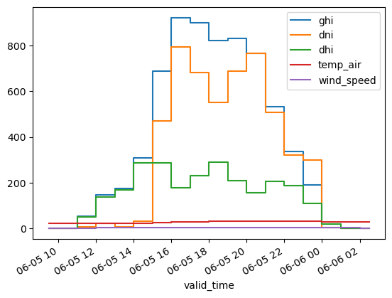
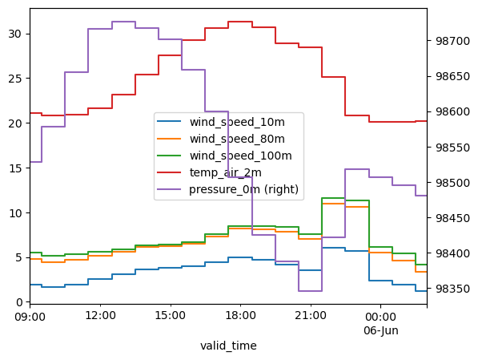

# hefty
Some (relatively) lightweight short-term **e**nergy **f**orecasting **t**ools for solar, wind, and load.

This repository currently includes solar and wind tools, but may expand one day to include electric load. Forecasts can be created using the following Numerical Weather Prediction (NWP) and Machine Learning Weather Prediction (MLWP) models:
- NOAA GFS
- NOAA GEFS
- NOAA HRRR
- ECMWF IFS (open data version)
- ECMWF AIFS
- ECMWF CAMS version of IFS* (a.k.a. "IFS-COMPO")

A detailed pvlib-based PV weather-to-power model is included in [pv_model.py](src/hefty/pv_model.py), `model_pv_power()`.

The [custom.py](src/hefty/custom.py) module is intended to help with getting forecasts of "custom" weather parameters, not necessarily specific to wind or solar, which migh be useful for load forecasting.

_*CAMS IFS is only available via `hefty.solar.get_solar_forecast()`, and it requires `cdsapi` to be installed and the user needs an API key (see https://ads.atmosphere.copernicus.eu/how-to-api and the [CAMS example notebook](examples/cams_example.ipynb))._

## Contents
- [Installation](#installation) - getting started
- [Quick example](#quick-examples) - a basic example of what hefty can do
- [Example notebooks](#example-notebooks) - overview of the provided Jupyter notebook examples
- [Supported forecast models](#supported-forecast-models) - description of NWP/MLWP models in hefty
- [Handling dates and times](#handling-dates-and-times) - dates/times are comlicated with forecasting
- [Local disk space](#local-disk-space) - downloads via hefty can use up a lot of storage space
- [Troubleshooting](#troubleshooting) - common issues and possible solutions
- [Data attribution](#data-attribution) - for using ECMWF data in particular
- [References](#references)

---
## Installation

A virtual environment is strongly recommended. You can install from PyPi with:

```
pip install hefty
```

To run the example Jupyter notebooks, you also need `jupyter`:

```
pip install jupyter
```

If you want to use ECMWF CAMS, you also need `cdsapi` (and an API key, see https://ads.atmosphere.copernicus.eu/how-to-api):

```
pip install cdsapi
```

## Quick example

Here's a quick example of getting a solar resource data forecast, assuming you have already determined the dates/times needed:

```python
from hefty.solar import get_solar_forecast

latitude = 33.5
longitude = -86.8
init_date = '2024-06-05 6:00' # datetime the forecast model was initialized
resource_data = get_solar_forecast(
    latitude,
    longitude,
    init_date,
    run_length=18, # 18 hours are included in the forecast
    lead_time_to_start=3, # forecast starts 3 hours out from the init_date
    model='hrrr', # use NOAA HRRR
)
resource_data[
    ['ghi','dni','dhi','temp_air','wind_speed']
              ].plot(drawstyle='steps-mid')
```

with this output:



<!-- Here's a wind resource forecast:

```python
from hefty.wind import get_wind_forecast

latitude = 33.5
longitude = -86.8
init_date = '2024-06-05 6:00' # datetime the forecast model was initialized
resource_data = get_wind_forecast(
    latitude,
    longitude,
    init_date,
    run_length=18, # 18 hours are included in the forecast
    lead_time_to_start=3, # forecast starts 3 hours out from the init_date
    model='gfs', # use NOAA GFS
)
resource_data[
    ['wind_speed_10m', 'wind_speed_80m',
    'wind_speed_100m', 'temp_air_2m', 
    'pressure_0m']
    ].plot(secondary_y=['pressure_0m'], drawstyle='steps-mid')
```
with this output (note that pressure is on the secondary y-axis):

 -->

## Example notebooks

The [examples](examples) folder contains several example Jupyter notebooks. 

- [solar_example.ipynb](examples/solar_example.ipynb): Example with multiple weather models, and includes power modeling with `model_pv_power()`.
- [more_solar_examples.ipynb](examples/more_solar_examples.ipynb): Expanded examples, including multiple sites and multiple forecast initialization times.
- [cams_example.ipynb](examples/cams_example.ipynb): Solar resource forecasting with CAMS IFS.
- [ensemble_example.ipynb](examples/ensemble_example.ipynb): Examples of multi-member ensembles with IFS, AIFS, and GEFS.
- [wind_example.ipynb](examples/wind_example.ipynb): A basic wind resource forecast example using a few models, including converting the data to a format compatible with `windpowerlib`*.
- [erbs_vs_dirindex.ipynb](examples/erbs_vs_dirindex.ipynb): A comparison of Erbs and DIRINDEX irradiance decomposition models using SURFRAD measurements.

\* https://github.com/wind-python/windpowerlib/

## Supported forecast models

The solar, wind, and datetime helper functions use these model names in the
`model` argument. The forecast span is the forecast-hour range available from
compatible model cycles. In general, `run_length + lead_time_to_start` must
fit inside the listed span for the selected cycle. Use
`adjust_forecast_datetimes()` to select an initialization time and lead-time
combination that satisfies cycle-specific limits. Note that these forecast model schedules/features can change over time, and the `get_fcast_definition` function in `hefty.utilities` is intended to record these changes.

| Model | Forecast type | Function support | Cycles | Available forecast span | Forecast-hour steps |
| --- | --- | --- | --- | --- | --- |
| `hrrr` | NOAA HRRR deterministic NWP | Solar, wind | Hourly; `00z`, `06z`, `12z`, and `18z` have extended range | `0`-`18` h; extended cycles: `0`-`48` h | 1 h |
| `gfs` | NOAA GFS deterministic NWP | Solar, wind | `00z`, `06z`, `12z`, `18z` | `0`-`120` h, then `123`-`384` h | 1 h through `120` h, then 3 h |
| `gefs` | NOAA GEFS ensemble NWP | Solar, wind, solar ensemble | `00z`, `06z`, `12z`, `18z` | `0`-`384` h. Solar uses 0.25 degree data through `240` h when available and 0.5 degree data beyond that. | 3 h |
| `ifs` | ECMWF IFS deterministic NWP | Solar, wind | `00z`, `06z`, `12z`, `18z`; `00z` and `12z` have extended range | `0`-`144` h; extended cycles: `150`-`360` h | 3 h through `144` h, then 6 h |
| `aifs` | ECMWF AIFS deterministic MLWP | Solar, wind | `00z`, `06z`, `12z`, `18z` | `0`-`360` h | 6 h |
| `cams` | ECMWF CAMS IFS composition forecast | Solar only via `get_solar_forecast` | `00z`, `12z` | `0`-`120` h. Requires `cdsapi` and a CDS API key. | 1 h |
| `ifs_ens` | ECMWF IFS ensemble NWP | Solar ensemble | `00z`, `06z`, `12z`, `18z`; `00z` and `12z` have extended range | `0`-`144` h; extended cycles: `150`-`360` h | 3 h through `144` h, then 6 h |
| `aifs_ens` | ECMWF AIFS ensemble MLWP | Solar ensemble | `00z`, `06z`, `12z`, `18z`; `00z` and `12z` have extended range | `00z` and `12z`: `0`-`360` h; `06z` and `18z`: `0`-`144` h | 6 h |

For ensemble forecasts, `get_solar_forecast_ensemble()` supports `ifs_ens`,
`aifs_ens`, and `gefs`. `get_solar_forecast_ensemble_subset()` currently
supports `ifs_ens` only.

Custom forecasts use the `period`, `product`, and `search_str` arguments
passed to `get_custom_forecast()`, rather than the model-specific
forecast-hour formatter used by the solar and wind tools.

## Handling dates and times

Handling dates and times can get a bit complicated when it comes to forecasts. hefty tries to match conventions used in the Solar Forecast Arbiter (https://forecastarbiter.epri.com/definitions/), such as "_lead time to start_" and "_run length_". However, the Arbiter uses the term "_issue time_" to represent the time that a forecast is issued/delivered, but that time is not necessarily directly relevant to NWP/MLWP outputs.

NWP/MLWP models typically have an **initialization time** (a.k.a. initialization date or datetime), which is (roughly) when the model started running, but the models can take many minutes to several hours to run and have output files posted online where hefty can access them. 

As a simplified example, assume a model:
- initialized at 00Z (midnight UTC) and 06Z, like GFS, GEFS, and IFS
- has 3 hour native interval length (like GEFS and IFS)
- and there's a 4.5 hour total delay in delivering outputs.

See the diagram below. If the current time is 07:00 UTC, and you want a forecast that covers 10:00 to 13:00 UTC, that's a desired lead time of 3 hr and a desired run length of 3 hours. Because the 06Z initialization time model run outputs will not be available until after 10:30, you will need to use the 00Z model outputs. And to get forecasted values that cover hours beginning 10:00-12:00 UTC, hefty will need to access the 9-, 12-, and 15-hour ahead outputs (labeled `f09`-`f15` below) from the 00Z forecast, which will be interpolated to hourly and will include the hours of interest.  

```
                                                 Current time
                                                      |
                                                      ↓----lead time---→|====run length===|
            |  |  |  |  |  |  |  |  |  |  |  |  |  |  |  |  |  |  |  |  |  |  |  |  |  |  |  |  |  |  | 
Hour (UTC): 00    01    02    03    04    05    06    07    08    09    10    11    12    13    14    15
            |XXXXXXXX 00z delay XXXXXXX|        |
            |f00--------------|f03--------------|f06--------------|f09--------------|f12--------------|f15
            |         00z NWP forecast          |         
            |                                   |
            00z init_date                       |XXXXXXXX 06z delay XXXXXXX|
                                                |f00--------------|f03--------------|f06--------------|f09
                                                |         06z NWP forecast
                                                |
                                                06z init_date         
```

To help with this, hefty includes a helper function in `hefty.utilities` called `adjust_forecast_datetimes`. Here's an example, similar to the illustration above, using GEFS:

```python
from hefty.utilities import adjust_forecast_datetimes

init_date, run_length, lead_time_to_start = adjust_forecast_datetimes(
    available_date='2026-04-23 07:00+00:00',
    run_length_needed=3,
    lead_time_to_start_needed=3,
    model='gefs'
)

print(f'init_date: {init_date}')
print(f'run_length: {run_length}')
print(f'lead_time_to_start: {lead_time_to_start}')
```
 with output

 ```
init_date: 2026-04-23 00:00:00+00:00
run_length: 6
lead_time_to_start: 9
 ```
Those outputs could then be directly passed as inputs to `hefty.solar.get_solar_forecast`. 

Model delays are more than just a fixed time: they can vary by lead time and by cycle time. And some cycles have different total run lengths and interval size for some models. `adjust_forecast_datetimes` adjusts for all of this for you.

Delays calculated in `adjust_forecast_datetimes` are based on experiments in this gist https://gist.github.com/williamhobbs/9585ff5d1248ab5de4d9e8665d7c8ea6 (which will hopefully one day be cleaned up and added to this repo somehow), documentation published by ECMWF, and this cool dashboard by dynamical.org https://dynamical.org/status/.

## Local disk space
The current version of hefty keeps copies of downloaded grib files on your local storage. This can result in a large amount of disk space being used up. Future versions of hefty may change this (see [issue #70](https://github.com/williamhobbs/hefty/issues/70)), but for now, users may need to monitor storage space and manually delete files if needed. 

hefty uses the directory configured by Herbie for storing files. See Herbie documentation here for details https://herbie.readthedocs.io/en/stable/user_guide/configure.html. The default `~\data` folder on Windows is `C:\Users\[username]\data`.

## Troubleshooting

### GRIB file issues
GRIB files can occasionally download with missing/incomplete artifacts. This has been known to cause errors like:

```
TypeError: objects must be an iterable containing only DataTree(s), Dataset(s), DataArray(s), and dictionaries: ['t2m']
```

If forecasts contain unexpected missing/incomplete values, try deleting cached GRIB files from your
Herbie cache. See the Herbie cache configuration docs:
https://herbie.readthedocs.io/en/stable/user_guide/configure.html. Navigating to the corresponding `~\data` folder, e.g., `C:\Users\[username]\data\ifs\20240605`, and deleting the contents may fix this.

If deleting the cache does not resolve the issue, try downloading the same
forecast from a different Herbie source, such as Azure, Google, or AWS.


### Server issues
ECMWF IFS/AIFS data have known issues via AWS that can result in 503 SlowDown responses. See https://forum.ecmwf.int/t/503-slowdown-errors-for-requests-to-s3-ecmwf-forecasts/14345, https://github.com/blaylockbk/Herbie/discussions/487. Using `priority='google'` (or `'azure'`) will likely help. 

Conversely, AWS may be more reliable than Google or Azure for NOAA models. 

### Install issues, Python version

If you have problems installing dependencies or get errors related to `eccodes` (e.g., `RuntimeError: Cannot find the ecCodes library`), one possibility is that you are using a version of Python that is not yet fully supported by some dependencies. Among other possibilities, ECMWF appears to sometimes get behind in publishing wheels for all platforms. If you are using one of the latest versions of Python, downgrading to an earlier version that is till in "bugfix" status, or even "security", may fix these issues. 

### Firewall/certificate issues
If you are using `hefty` behind a firewall, you might run into SLL/certificate issues. Making sure that Python knows where to find valid local certificates might help. _Potential_ solutions include the following, but check with your IT/security resources first:

**Option 1**: Install `pip-system-certs`:

```bash
pip install pip_system_certs
```

**Option 2**: Use `certifi` and set environment variables at the beginning of each script/notebook:

```python 
import certifi
# Set requests to use the certificates in your current environment
os.environ['REQUESTS_CA_BUNDLE'] = certifi.where()
os.environ['CURL_CA_BUNDLE'] = certifi.where()
```

### Intermittent SSL errors
In some instances, intermittent SSL errors (`Exception has occured : Processing failed:`... `[SSL: UNEXPECTED_EOF_WHILE_READING]` ...) _might_ be fixed by upgrading urllib3, e.g., `pip install --upgrade urllib3`.

## Data attribution
### ECMWF
If you use models from ECMWF, you may need to include attribution language with the results. 

For IFS and AIFS open data (`model='ifs'` or `model='aifs'`), please see the [ECMWF license terms](https://apps.ecmwf.int/datasets/licences/general/). For the CAMS version of IFS (`model='cams'`), please see the *References* and *License* sections of the [CAMS global atmospheric composition forecasts](https://ads.atmosphere.copernicus.eu/datasets/cams-global-atmospheric-composition-forecasts?tab=overview) page. 

A possible example attribution for IFS and AIFS:

> This document/data/output/Results is/are based on data and products of the European Centre for Medium-Range Weather Forecasts (ECMWF). © 2026 European Centre for Medium-Range Weather Forecasts (ECMWF), www.ecmwf.int. This data is published under a Creative Commons Attribution 4.0 International (CC BY 4.0). https://creativecommons.org/licenses/by/4.0/.  ECMWF does not accept any liability whatsoever for any error or omission in the data, their availability, or for any loss or damage arising from their use.
>
>ECMWF Data have been modified using the functions included in the hefty Python package (e.g., interpolation to hourly values).

A possible example attribution and citation for the CAMS version of IFS:

> Contains modified Copernicus Atmosphere Monitoring Service information [2026]. Neither the European Commission nor ECMWF is responsible for any use that may be made of the Copernicus information or data it contains.  © 2026 European Centre for Medium-Range Weather Forecasts (ECMWF), www.ecmwf.int. This data is published under a Creative Commons Attribution 4.0 International (CC BY 4.0). https://creativecommons.org/licenses/by/4.0/.
>
> Copernicus Atmosphere Monitoring Service (2021): CAMS global atmospheric composition forecasts. Copernicus Atmosphere Monitoring Service (CAMS) Atmosphere Data Store, DOI: 10.24381/04a0b097 (Accessed on DD-MMM-YYYY).


## References
This project uses several Python packages, including pvlib, an open-source solar PV modeling package [1, 2], and Herbie [3, 4], a package for accessing weather forecast data from NOAA. `pv_model.py` (with the `model_pv_power()` function used here) comes from [5] which leverages some functions from [6].


[1] Anderson, K., Hansen, C., Holmgren, W., Jensen, A., Mikofski, M., and Driesse, A. “pvlib python: 2023 project update.” Journal of Open Source Software, 8(92), 5994, (2023). [DOI: 10.21105/joss.05994](http://dx.doi.org/10.21105/joss.05994).

[2] https://github.com/pvlib/pvlib-python

[3] Blaylock, B. K. (2025). Herbie: Retrieve Numerical Weather Prediction Model Data (Version 2025.3.1) [Computer software]. https://doi.org/10.5281/zenodo.4567540

[4] https://github.com/blaylockbk/Herbie

[5] https://github.com/williamhobbs/pv-system-model

[6] Hobbs, W., Anderson, K., Mikofski, M., and Ghiz, M. "An approach to modeling linear and non-linear self-shading losses with pvlib." 2024 PV Performance Modeling Collaborative (PVPMC). https://github.com/williamhobbs/2024_pvpmc_self_shade
